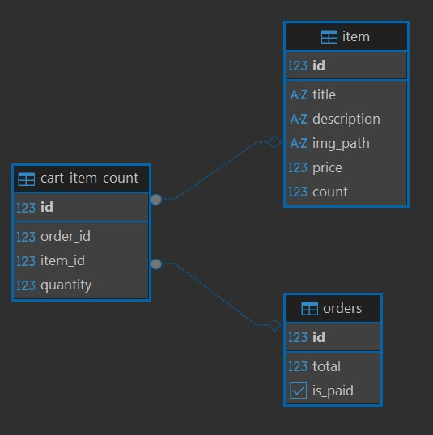

# Бэкенд веб-приложения магазина 
написан с использованием Spring Boot (версия 6.1 и выше),выполняющегося из Docker Containers.

## Схема базы данных

## Сборка проекта
Проект основан на jdk 21, db Postgresql, Spring Boot, Spring Data
1. сборка в maven по команде `gradle bootJar` или `./gradlew bootJar`
2. разворачивания контейнера в докере команда `docker-compose up -d`